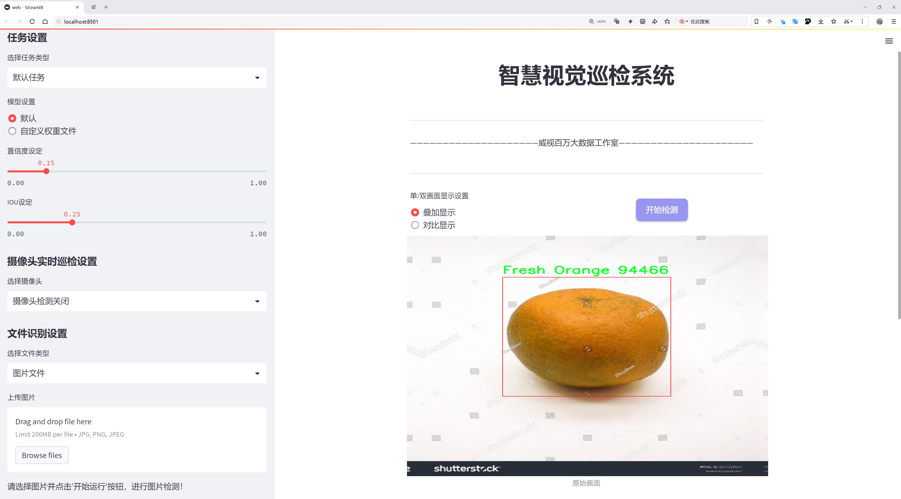
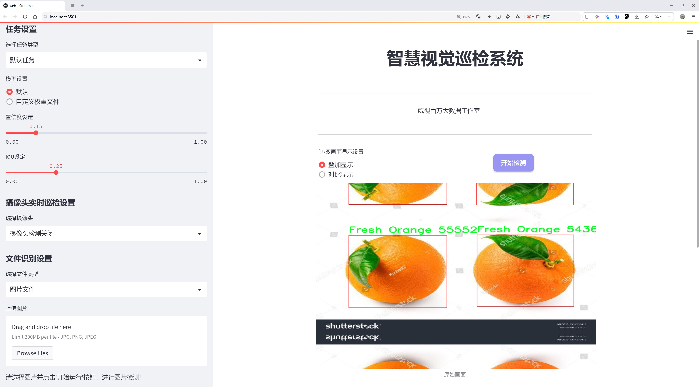
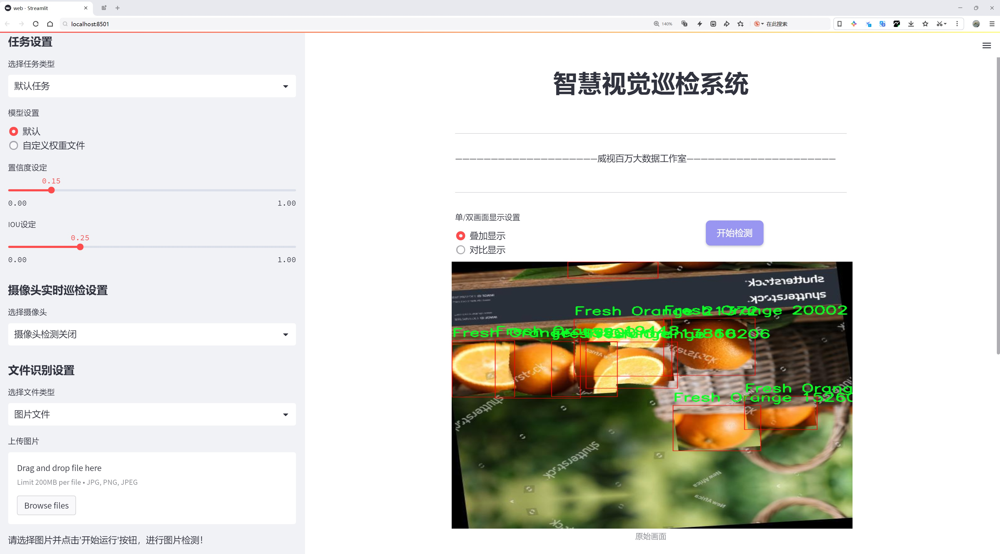
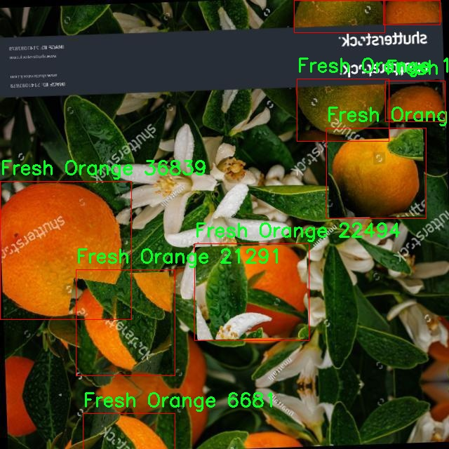
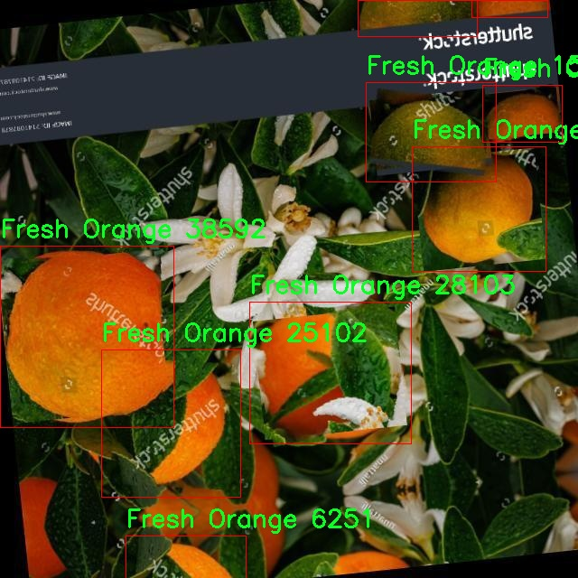
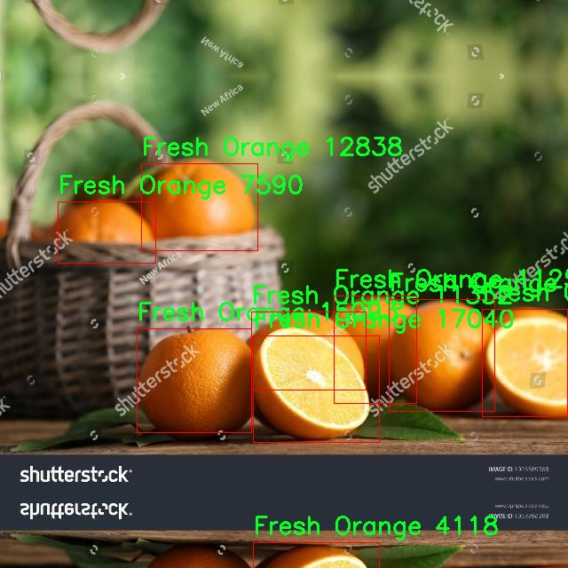
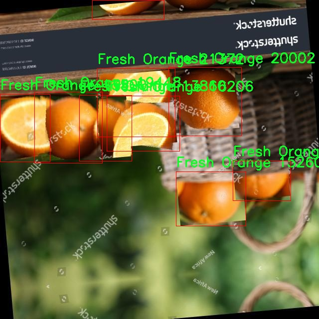
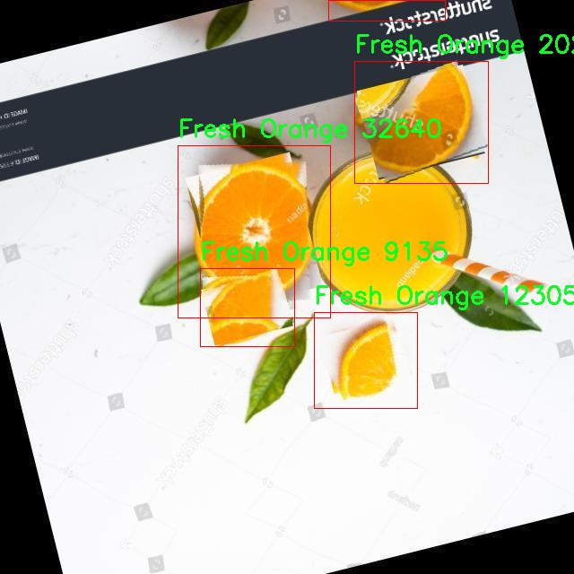

# 橙子新鲜度检测检测系统源码分享
 # [一条龙教学YOLOV8标注好的数据集一键训练_70+全套改进创新点发刊_Web前端展示]

### 1.研究背景与意义

项目参考[AAAI Association for the Advancement of Artificial Intelligence](https://gitee.com/qunmasj/projects)

项目来源[AACV Association for the Advancement of Computer Vision](https://github.com/qunshansj/good)

研究背景与意义

随着全球经济的发展和人们生活水平的提高，水果消费逐渐成为日常饮食的重要组成部分。在众多水果中，橙子因其丰富的营养价值和良好的口感而受到广泛欢迎。然而，橙子的保鲜问题始终是影响其市场价值和消费者满意度的重要因素。橙子的鲜度直接关系到其口感、营养成分以及食用安全性，因此，如何快速、准确地检测橙子的鲜度，成为了果品流通领域亟待解决的技术难题。

传统的橙子鲜度检测方法多依赖于人工经验和简单的物理检测手段，这不仅效率低下，而且容易受到主观因素的影响，导致检测结果的不准确。随着计算机视觉和深度学习技术的迅猛发展，基于图像处理的水果鲜度检测系统逐渐成为研究热点。YOLO（You Only Look Once）系列算法因其高效的实时检测能力和较高的准确率，已被广泛应用于各类物体检测任务中。YOLOv8作为该系列的最新版本，具备了更强的特征提取能力和更快的推理速度，为水果鲜度检测提供了新的技术支持。

本研究旨在基于改进的YOLOv8算法，构建一个高效的橙子新鲜度检测系统。我们将使用包含8909张图像的数据集，该数据集涵盖了两类橙子：新鲜橙子和腐烂橙子。这一数据集的丰富性为模型的训练和测试提供了良好的基础，使得检测系统能够在多种环境和条件下进行有效的鲜度判别。通过对YOLOv8算法的改进，我们希望能够提升模型在橙子鲜度检测中的准确性和鲁棒性，从而为果品行业提供一种高效、智能的解决方案。

此外，橙子鲜度检测系统的研究不仅具有重要的学术价值，也具备广泛的应用前景。该系统可以应用于果品生产、运输、销售等各个环节，帮助果农、商家和消费者更好地识别橙子的鲜度，降低损耗，提高经济效益。同时，该技术的推广应用也有助于提升食品安全水平，减少因食用腐烂水果而引发的健康问题。通过实现智能化的橙子鲜度检测，我们不仅能够推动农业现代化的发展，还能够促进可持续发展目标的实现。

综上所述，基于改进YOLOv8的橙子新鲜度检测系统的研究，既是对现有检测技术的创新与提升，也是对果品流通领域实际需求的积极响应。通过深入探讨和实践这一研究课题，我们期待能够为水果鲜度检测提供新的思路和方法，推动相关领域的进一步发展。

### 2.图片演示







##### 注意：由于此博客编辑较早，上面“2.图片演示”和“3.视频演示”展示的系统图片或者视频可能为老版本，新版本在老版本的基础上升级如下：（实际效果以升级的新版本为准）

  （1）适配了YOLOV8的“目标检测”模型和“实例分割”模型，通过加载相应的权重（.pt）文件即可自适应加载模型。

  （2）支持“图片识别”、“视频识别”、“摄像头实时识别”三种识别模式。

  （3）支持“图片识别”、“视频识别”、“摄像头实时识别”三种识别结果保存导出，解决手动导出（容易卡顿出现爆内存）存在的问题，识别完自动保存结果并导出到tempDir中。

  （4）支持Web前端系统中的标题、背景图等自定义修改，后面提供修改教程。

  另外本项目提供训练的数据集和训练教程,暂不提供权重文件（best.pt）,需要您按照教程进行训练后实现图片演示和Web前端界面演示的效果。

### 3.视频演示

[3.1 视频演示](https://www.bilibili.com/video/BV1DPHVePEE7/?vd_source=ff015de2d29cbe2a9cdbfa7064407a08)

### 4.数据集信息展示

数据集信息展示

在现代计算机视觉领域，数据集的质量和多样性直接影响到模型的性能和应用效果。本数据集名为“Orage”，专门用于训练和改进YOLOv8的橙子新鲜度检测系统。该数据集包含8909张图像，涵盖了两种主要类别：新鲜橙子和腐烂橙子。这一分类设计不仅使得模型能够有效区分橙子的不同新鲜度状态，还为实际应用提供了重要的参考依据。

数据集中包含的8909张图像经过精心挑选，确保了在不同光照、角度和背景下的多样性。这种多样性对于训练深度学习模型至关重要，因为它能够帮助模型学习到更为丰富的特征，从而提高其在实际应用中的鲁棒性和准确性。新鲜橙子和腐烂橙子的图像分别被标注，确保了每一张图像都能为模型提供清晰的学习信号。

在数据集的构建过程中，特别注意了图像的质量和标注的准确性。每一类橙子的图像都经过严格的审核，以确保其真实反映了该类别的特征。例如，新鲜橙子的图像展示了其鲜亮的颜色和光滑的表面，而腐烂橙子的图像则突出了表面的斑点和变色等特征。这种清晰的视觉差异为YOLOv8模型的训练提供了坚实的基础，使其能够在检测过程中快速而准确地做出判断。

此外，本数据集的使用遵循CC BY 4.0许可证，这意味着用户可以自由地使用、修改和分发数据集，只需给予适当的署名。这种开放的许可方式促进了学术界和工业界的合作与创新，使得更多的研究者和开发者能够利用这一数据集来推动橙子新鲜度检测技术的发展。

在实际应用中，橙子新鲜度检测系统可以广泛应用于农业、食品安全和供应链管理等领域。通过准确识别橙子的新鲜度，农民和商家能够更好地管理库存，减少浪费，提高经济效益。同时，消费者也能够通过这一系统获得更高质量的产品，提升购物体验。

总之，数据集“Orage”不仅为YOLOv8模型的训练提供了丰富的视觉数据，还为橙子新鲜度检测技术的研究和应用奠定了坚实的基础。随着深度学习技术的不断进步和数据集的不断完善，未来的橙子新鲜度检测系统将更加智能化、精准化，为各行各业带来更大的价值。











### 5.全套项目环境部署视频教程（零基础手把手教学）

[5.1 环境部署教程链接（零基础手把手教学）](https://www.ixigua.com/7404473917358506534?logTag=c807d0cbc21c0ef59de5)


[5.2 安装Python虚拟环境创建和依赖库安装视频教程链接（零基础手把手教学）](https://www.ixigua.com/7404474678003106304?logTag=1f1041108cd1f708b01a)

### 6.手把手YOLOV8训练视频教程（零基础小白有手就能学会）

[6.1 环境部署教程链接（零基础手把手教学）](https://www.ixigua.com/7404477157818401292?logTag=d31a2dfd1983c9668658)

### 7.70+种全套YOLOV8创新点代码加载调参视频教程（一键加载写好的改进模型的配置文件）

[7.1 环境部署教程链接（零基础手把手教学）](https://www.ixigua.com/7404478314661806627?logTag=29066f8288e3f4eea3a4)

### 8.70+种全套YOLOV8创新点原理讲解（非科班也可以轻松写刊发刊，V10版本正在科研待更新）

由于篇幅限制，每个创新点的具体原理讲解就不一一展开，具体见下列网址中的创新点对应子项目的技术原理博客网址【Blog】：


[8.1 70+种全套YOLOV8创新点原理讲解链接](https://gitee.com/qunmasj/good)

### 9.系统功能展示（检测对象为举例，实际内容以本项目数据集为准）

图9.1.系统支持检测结果表格显示

  图9.2.系统支持置信度和IOU阈值手动调节

  图9.3.系统支持自定义加载权重文件best.pt(需要你通过步骤5中训练获得)

  图9.4.系统支持摄像头实时识别

  图9.5.系统支持图片识别

  图9.6.系统支持视频识别

  图9.7.系统支持识别结果文件自动保存

  图9.8.系统支持Excel导出检测结果数据


### 10.原始YOLOV8算法原理

原始YOLOv8算法原理

YOLOv8算法是YOLO系列模型的最新版本，由Glenn-Jocher提出，延续了YOLOv3和YOLOv5的优良传统，同时在多个方面进行了显著的改进。作为一种目标检测算法，YOLOv8在速度和精度上都表现出色，成为了当前业界最受欢迎的模型之一。其设计理念旨在通过高效的特征提取和处理，快速准确地识别图像中的目标物体。YOLOv8的网络结构由三部分组成：Backbone、Neck和Head，分别负责特征提取、特征融合和最终的检测输出。

在数据预处理方面，YOLOv8继承了YOLOv5的策略，采用了多种增强手段以提高模型的鲁棒性和泛化能力。具体而言，算法使用了马赛克增强、混合增强、空间扰动和颜色扰动等技术。这些增强手段能够有效地扩展训练数据集，帮助模型更好地适应不同的场景和物体变形，从而提升检测性能。

YOLOv8的骨干网络结构在YOLOv5的基础上进行了优化。YOLOv5的主干网络采用了逐层降采样的方式，每经过一层步长为2的3×3卷积，便接入一个C3模块以强化特征提取。YOLOv8则将C3模块替换为新的C2f模块，C2f模块通过引入更多的分支，丰富了梯度回传的路径，使得特征提取过程更加高效。这种结构不仅提升了特征提取的能力，还为后续的特征融合提供了更为丰富的信息。

在特征融合方面，YOLOv8依然采用了FPN（Feature Pyramid Network）和PAN（Path Aggregation Network）结构，以实现多尺度信息的充分融合。尽管FPN-PAN的整体架构与YOLOv5基本一致，但YOLOv8在其中的C3模块被替换为C2f模块，进一步增强了特征融合的效果。这种设计使得YOLOv8能够更好地处理不同尺度的目标，提升了对小目标的检测能力。

YOLOv8在检测头的设计上也进行了重要的改进。传统的YOLO系列模型在检测头中采用耦合结构，即通过一层卷积同时完成分类和定位任务。而YOLOv8则引入了解耦头结构，将分类和定位任务分开处理，分别通过两条并行的分支提取类别特征和位置特征。这种解耦设计使得模型在处理复杂场景时能够更为精准，降低了分类和定位之间的干扰，从而提升了整体的检测性能。

在标签分配策略方面，YOLOv8采用了与YOLOv6相同的TOOD（Task-Oriented Object Detection）策略。这一动态标签分配策略不再依赖于候选框的聚类，而是通过目标框和目标分数的直接关联来实现正负样本的匹配。这种方法避免了由于数据集不足而导致的候选框不准确的问题，使得模型在训练过程中能够更好地适应真实场景的分布特征。

YOLOv8的损失函数设计也体现了其在目标检测中的创新。分类损失采用了变焦损失（Varifocal Loss），而回归损失则结合了CIoU（Complete Intersection over Union）损失和DFL（Distribution Focal Loss）。变焦损失通过不对称参数对正负样本进行加权，使得模型在训练时更加关注高质量的正样本，从而提升了检测精度。对于负样本，变焦损失则通过降低其对损失的贡献，避免了负样本对模型训练的干扰。

总的来说，YOLOv8算法通过一系列创新的设计和优化，提升了目标检测的速度和精度。其独特的网络结构、有效的数据增强策略、动态的标签分配方法以及精细的损失函数设计，使得YOLOv8在处理复杂场景和多尺度目标时表现出色。随着YOLOv8的广泛应用，它不仅为目标检测领域带来了新的思路，也为相关研究提供了更为强大的工具，推动了计算机视觉技术的进一步发展。


### 11.项目核心源码讲解（再也不用担心看不懂代码逻辑）

#### 11.1 ultralytics\models\fastsam\__init__.py

下面是对给定代码的逐行分析和核心部分的保留，同时添加了详细的中文注释：

```python
# Ultralytics YOLO 🚀, AGPL-3.0 license

# 从当前包中导入 FastSAM 模型类
from .model import FastSAM

# 从当前包中导入 FastSAMPredictor 类，用于预测
from .predict import FastSAMPredictor

# 从当前包中导入 FastSAMPrompt 类，用于处理提示信息
from .prompt import FastSAMPrompt

# 从当前包中导入 FastSAMValidator 类，用于验证模型性能
from .val import FastSAMValidator

# 定义模块的公开接口，允许用户直接导入这些类
__all__ = "FastSAMPredictor", "FastSAM", "FastSAMPrompt", "FastSAMValidator"
```

### 核心部分分析

1. **导入模块**：
   - 代码中使用了相对导入的方式，导入了四个类：`FastSAM`、`FastSAMPredictor`、`FastSAMPrompt` 和 `FastSAMValidator`。这些类分别代表了模型、预测器、提示处理器和验证器。

2. **`__all__` 的定义**：
   - `__all__` 是一个特殊的变量，用于定义当使用 `from module import *` 时，哪些类或函数会被导入。这里定义了四个类，表示这些是模块的公共接口。

### 代码的功能
- 该代码片段是一个模块的初始化文件，主要用于导入和暴露该模块中最重要的类，使得用户可以方便地使用这些功能。

这个文件是一个Python模块的初始化文件，位于Ultralytics YOLO项目的`fastsam`子目录下。它的主要作用是导入该模块中的其他组件，并定义模块的公共接口。

首先，文件开头的注释部分提到这是Ultralytics YOLO项目的一部分，并且该项目遵循AGPL-3.0许可证。这表明该项目是开源的，用户可以自由使用和修改，但需要遵循相应的许可证条款。

接下来，文件通过`from .model import FastSAM`等语句导入了四个类或函数：`FastSAM`、`FastSAMPredictor`、`FastSAMPrompt`和`FastSAMValidator`。这些组件可能分别负责不同的功能，比如模型定义、预测、提示处理和验证等。

最后，`__all__`变量被定义为一个元组，包含了刚刚导入的四个组件的名称。这一行的作用是明确该模块的公共接口，意味着当使用`from fastsam import *`这种方式导入模块时，只会导入`__all__`中列出的组件。这有助于控制模块的命名空间，避免不必要的名称冲突，并提高代码的可读性。

总体而言，这个初始化文件的功能相对简单，但它在模块的结构和可用性方面起到了重要的作用。

#### 11.2 ui.py

```python
import sys
import subprocess

def run_script(script_path):
    """
    使用当前 Python 环境运行指定的脚本。

    Args:
        script_path (str): 要运行的脚本路径

    Returns:
        None
    """
    # 获取当前 Python 解释器的路径
    python_path = sys.executable

    # 构建运行命令，使用 streamlit 运行指定的脚本
    command = f'"{python_path}" -m streamlit run "{script_path}"'

    # 执行命令并等待其完成
    result = subprocess.run(command, shell=True)
    
    # 检查命令执行的返回码，如果不为0则表示出错
    if result.returncode != 0:
        print("脚本运行出错。")


# 实例化并运行应用
if __name__ == "__main__":
    # 指定要运行的脚本路径
    script_path = "web.py"  # 这里可以直接使用相对路径

    # 调用函数运行脚本
    run_script(script_path)
```

### 代码注释说明：
1. **导入模块**：
   - `sys`：用于获取当前 Python 解释器的路径。
   - `subprocess`：用于执行外部命令。

2. **定义 `run_script` 函数**：
   - 该函数接收一个脚本路径作为参数，并使用当前 Python 环境运行该脚本。
   - `python_path = sys.executable`：获取当前 Python 解释器的完整路径。
   - `command`：构建一个命令字符串，使用 `streamlit` 模块运行指定的脚本。
   - `subprocess.run(command, shell=True)`：执行构建的命令并等待其完成。
   - `result.returncode`：检查命令的返回码，如果不为0，表示脚本运行出错，打印错误信息。

3. **主程序入口**：
   - `if __name__ == "__main__":`：确保只有在直接运行该脚本时才会执行以下代码。
   - `script_path = "web.py"`：指定要运行的脚本路径。
   - `run_script(script_path)`：调用函数来运行指定的脚本。

这个程序文件名为 `ui.py`，主要功能是使用当前的 Python 环境来运行一个指定的脚本，具体是通过 Streamlit 框架来启动一个 Web 应用。

首先，程序导入了几个必要的模块，包括 `sys`、`os` 和 `subprocess`。其中，`sys` 模块用于访问与 Python 解释器相关的变量和函数，`os` 模块提供了与操作系统交互的功能，而 `subprocess` 模块则用于执行外部命令。

接着，程序从 `QtFusion.path` 模块中导入了 `abs_path` 函数，这个函数的作用是获取文件的绝对路径。

在 `run_script` 函数中，首先定义了一个参数 `script_path`，它表示要运行的脚本的路径。函数内部首先获取当前 Python 解释器的路径，这通过 `sys.executable` 实现。然后，构建一个命令字符串，使用 `streamlit run` 命令来运行指定的脚本。这个命令会在当前的 Python 环境中执行。

接下来，使用 `subprocess.run` 方法来执行构建好的命令。`shell=True` 参数允许在 shell 中执行命令。执行完命令后，程序检查返回码，如果返回码不为 0，表示脚本运行出错，程序会打印出错误信息。

在文件的最后部分，使用 `if __name__ == "__main__":` 语句来确保只有在直接运行该脚本时才会执行后面的代码。在这里，指定了要运行的脚本路径为 `web.py`，并调用 `run_script` 函数来启动这个脚本。

总的来说，这个程序的主要作用是为指定的 Streamlit 脚本提供一个运行环境，使得用户可以方便地启动和运行 Web 应用。

#### 11.3 ultralytics\utils\files.py

以下是代码中最核心的部分，并附上详细的中文注释：

```python
import os
from pathlib import Path
from contextlib import contextmanager

@contextmanager
def spaces_in_path(path):
    """
    处理路径中包含空格的上下文管理器。如果路径包含空格，则将其替换为下划线，
    复制文件/目录到新路径，执行上下文代码块，然后将文件/目录复制回原位置。

    参数:
        path (str | Path): 原始路径。

    生成:
        (Path): 如果路径中有空格，则返回替换下划线的临时路径，否则返回原始路径。
    """
    # 如果路径中有空格，将其替换为下划线
    if " " in str(path):
        path = Path(path)  # 将路径转换为Path对象

        # 创建一个临时目录并构造新的路径
        with tempfile.TemporaryDirectory() as tmp_dir:
            tmp_path = Path(tmp_dir) / path.name.replace(" ", "_")  # 替换空格后的新路径

            # 复制文件/目录
            if path.is_dir():
                shutil.copytree(path, tmp_path)  # 复制目录
            elif path.is_file():
                shutil.copy2(path, tmp_path)  # 复制文件

            try:
                # 返回临时路径
                yield tmp_path
            finally:
                # 将文件/目录复制回原位置
                if tmp_path.is_dir():
                    shutil.copytree(tmp_path, path, dirs_exist_ok=True)
                elif tmp_path.is_file():
                    shutil.copy2(tmp_path, path)  # 复制回文件

    else:
        # 如果没有空格，直接返回原始路径
        yield path


def increment_path(path, exist_ok=False, sep="", mkdir=False):
    """
    增加文件或目录路径，即将路径增加一个数字后缀，例如 runs/exp --> runs/exp{sep}2, runs/exp{sep}3 等。

    如果路径存在且exist_ok未设置为True，则路径将通过在路径末尾附加数字和分隔符进行递增。
    如果路径是文件，则保留文件扩展名；如果路径是目录，则数字将直接附加到路径末尾。
    如果mkdir设置为True，则如果路径不存在，将创建该路径作为目录。

    参数:
        path (str, pathlib.Path): 要递增的路径。
        exist_ok (bool, optional): 如果为True，则路径将不递增并按原样返回。默认为False。
        sep (str, optional): 在路径和递增数字之间使用的分隔符。默认为''。
        mkdir (bool, optional): 如果不存在，则创建目录。默认为False。

    返回:
        (pathlib.Path): 递增后的路径。
    """
    path = Path(path)  # 使路径与操作系统无关
    if path.exists() and not exist_ok:
        path, suffix = (path.with_suffix(""), path.suffix) if path.is_file() else (path, "")

        # 方法1
        for n in range(2, 9999):
            p = f"{path}{sep}{n}{suffix}"  # 递增路径
            if not os.path.exists(p):
                break
        path = Path(p)

    if mkdir:
        path.mkdir(parents=True, exist_ok=True)  # 创建目录

    return path
```

### 代码核心部分说明：

1. **`spaces_in_path` 函数**：
   - 该函数是一个上下文管理器，用于处理路径中包含空格的情况。它会在执行代码块之前将路径中的空格替换为下划线，并在代码块执行后将文件或目录复制回原位置。

2. **`increment_path` 函数**：
   - 该函数用于递增文件或目录的路径。如果路径已存在，则会在路径后添加一个数字后缀以避免冲突。可以选择创建目录并返回递增后的路径。

这两个函数是文件和目录操作中非常实用的工具，尤其是在处理路径时。

这个程序文件 `ultralytics/utils/files.py` 是一个用于处理文件和目录的实用工具模块，主要用于在 Ultralytics YOLO 项目中。文件中包含了一些类和函数，帮助用户更方便地管理文件路径、处理文件和目录的增量命名、获取文件的修改时间和大小等。

首先，定义了一个 `WorkingDirectory` 类，它是一个上下文管理器，允许用户在指定的工作目录中执行代码。当用户实例化这个类并进入上下文时，当前工作目录会被更改为指定的目录；当退出上下文时，工作目录会恢复到原来的位置。这种设计使得在特定目录下执行操作变得简单而安全。

接下来，定义了一个 `spaces_in_path` 的上下文管理器，用于处理路径中包含空格的情况。如果路径中有空格，它会将空格替换为下划线，并将文件或目录复制到一个临时路径中。在执行上下文代码块后，它会将文件或目录复制回原来的位置。这种处理方式可以避免在某些情况下因路径中包含空格而导致的问题。

然后是 `increment_path` 函数，它用于对文件或目录路径进行增量命名。如果指定的路径已经存在，并且 `exist_ok` 参数为 `False`，则会在路径后面添加一个数字后缀，以避免命名冲突。这个函数还支持创建目录的功能，如果 `mkdir` 参数为 `True`，则会在路径不存在时创建它。

此外，文件中还包含了一些用于获取文件信息的函数，包括 `file_age`、`file_date` 和 `file_size`。`file_age` 函数返回自上次修改以来的天数，`file_date` 函数返回可读的文件修改日期，而 `file_size` 函数则返回文件或目录的大小（以MB为单位）。这些函数提供了对文件状态的基本查询功能。

最后，`get_latest_run` 函数用于查找指定目录下最新的 `last.pt` 文件，通常用于恢复训练或推理的状态。它通过递归搜索指定目录，返回最新文件的路径。

总体而言，这个文件提供了一系列实用的工具函数和上下文管理器，帮助用户在文件和目录操作中更加高效和便捷。

#### 11.4 ultralytics\utils\callbacks\comet.py

以下是经过简化和注释的核心代码部分，主要涉及与 Comet.ml 进行集成的功能：

```python
# 导入必要的库
from ultralytics.utils import LOGGER, RANK, SETTINGS, ops
import os
from pathlib import Path

# 尝试导入 Comet.ml 库并进行基本的设置检查
try:
    assert SETTINGS["comet"] is True  # 确保集成已启用
    import comet_ml
    assert hasattr(comet_ml, "__version__")  # 确保导入的是包而非目录
except (ImportError, AssertionError):
    comet_ml = None  # 如果导入失败，则将 comet_ml 设置为 None

def _get_comet_mode():
    """获取环境变量中设置的 Comet 模式，默认为 'online'。"""
    return os.getenv("COMET_MODE", "online")

def _create_experiment(args):
    """创建 Comet 实验对象，确保在分布式训练中只在一个进程中创建。"""
    if RANK not in (-1, 0):  # 仅在主进程中创建实验
        return
    try:
        comet_mode = _get_comet_mode()
        project_name = os.getenv("COMET_PROJECT_NAME", args.project)
        experiment = comet_ml.Experiment(project_name=project_name) if comet_mode != "offline" else comet_ml.OfflineExperiment(project_name=project_name)
        experiment.log_parameters(vars(args))  # 记录参数
    except Exception as e:
        LOGGER.warning(f"WARNING ⚠️ Comet installed but not initialized correctly, not logging this run. {e}")

def on_pretrain_routine_start(trainer):
    """在 YOLO 预训练例程开始时创建或恢复 CometML 实验。"""
    experiment = comet_ml.get_global_experiment()
    if not experiment or not getattr(experiment, "alive", False):
        _create_experiment(trainer.args)

def on_train_epoch_end(trainer):
    """在训练周期结束时记录指标并保存批次图像。"""
    experiment = comet_ml.get_global_experiment()
    if not experiment:
        return

    curr_epoch = trainer.epoch + 1
    curr_step = curr_epoch * (len(trainer.train_loader.dataset) // trainer.batch_size)
    experiment.log_metrics(trainer.label_loss_items(trainer.tloss, prefix="train"), step=curr_step, epoch=curr_epoch)

def on_train_end(trainer):
    """在训练结束时执行操作。"""
    experiment = comet_ml.get_global_experiment()
    if not experiment:
        return

    curr_epoch = trainer.epoch + 1
    curr_step = curr_epoch * (len(trainer.train_loader.dataset) // trainer.batch_size)
    experiment.log_metrics(trainer.metrics, step=curr_step, epoch=curr_epoch)  # 记录最终指标
    experiment.end()  # 结束实验

# 定义回调函数
callbacks = {
    "on_pretrain_routine_start": on_pretrain_routine_start,
    "on_train_epoch_end": on_train_epoch_end,
    "on_train_end": on_train_end,
} if comet_ml else {}
```

### 代码注释说明：
1. **导入库**：导入必要的库和模块，包括 `comet_ml` 用于实验记录。
2. **环境变量检查**：通过环境变量检查 Comet 的集成状态，确保在使用前 Comet 已正确安装。
3. **实验创建**：`_create_experiment` 函数用于创建 Comet 实验对象，并记录训练参数。
4. **训练回调**：
   - `on_pretrain_routine_start`：在预训练开始时创建或恢复实验。
   - `on_train_epoch_end`：在每个训练周期结束时记录当前的训练指标。
   - `on_train_end`：在训练结束时记录最终的训练指标并结束实验。

以上代码展示了如何将 YOLO 训练过程中的关键指标和参数记录到 Comet.ml，以便后续分析和可视化。

这个程序文件 `comet.py` 是 Ultralytics YOLO 项目的一部分，主要用于集成 Comet.ml 进行实验的监控和记录。文件的开头部分引入了一些必要的库和模块，并进行了一些基本的检查，比如确保在运行测试时不记录日志，并确认 Comet 集成已启用。

接下来的部分定义了一些辅助函数，这些函数用于获取环境变量中的设置，例如 Comet 的工作模式、模型名称、评估批次日志记录间隔、最大图像预测数量等。这些设置可以通过环境变量进行配置，以便用户根据需要调整实验的行为。

文件中还定义了一些函数来处理与图像预测和真实标签相关的操作，包括缩放置信度分数、格式化真实标签和预测结果、以及将边界框从缩放后的图像形状转换回原始图像形状。这些功能确保了在记录和可视化时，数据的准确性和一致性。

在训练过程中，程序会创建一个 Comet 实验对象，并在适当的时机记录训练的参数、指标和图像。具体来说，程序会在训练的每个周期结束时记录当前的损失、学习率、模型的最佳状态以及混淆矩阵等信息。此外，程序还会在训练结束时记录最终的模型和评估图表。

文件的最后部分定义了一些回调函数，这些函数在特定的训练阶段被调用，例如在预训练开始时、每个训练周期结束时、每个拟合周期结束时和训练结束时。这些回调函数负责调用之前定义的记录和日志功能，确保在训练过程中将所有重要的信息记录到 Comet 实验中。

总的来说，这个文件的主要目的是通过与 Comet.ml 的集成，帮助用户监控和记录 YOLO 模型的训练过程，以便进行后续的分析和可视化。

#### 11.5 train.py

以下是代码中最核心的部分，并附上详细的中文注释：

```python
import os
import torch
import yaml
from ultralytics import YOLO  # 导入YOLO模型库
from QtFusion.path import abs_path  # 导入获取绝对路径的函数

# 检测是否有可用的GPU，如果有则使用GPU，否则使用CPU
device = "0" if torch.cuda.is_available() else "cpu"

if __name__ == '__main__':  # 确保该模块被直接运行时才执行以下代码
    workers = 1  # 设置数据加载的工作进程数量
    batch = 2    # 设置每个批次的样本数量

    data_name = "data"  # 数据集名称
    # 获取数据集配置文件的绝对路径
    data_path = abs_path(f'datasets/{data_name}/{data_name}.yaml', path_type='current')  
    unix_style_path = data_path.replace(os.sep, '/')  # 将路径转换为Unix风格

    # 获取数据集目录的路径
    directory_path = os.path.dirname(unix_style_path)
    
    # 读取YAML格式的数据集配置文件
    with open(data_path, 'r') as file:
        data = yaml.load(file, Loader=yaml.FullLoader)
    
    # 如果配置文件中有'path'项，则修改为当前目录路径
    if 'path' in data:
        data['path'] = directory_path
        # 将修改后的数据写回YAML文件
        with open(data_path, 'w') as file:
            yaml.safe_dump(data, file, sort_keys=False)

    # 加载YOLOv8模型，指定模型配置文件和任务类型
    model = YOLO(model='./ultralytics/cfg/models/v8/yolov8s.yaml', task='detect')  
    
    # 开始训练模型
    results2 = model.train(  
        data=data_path,  # 指定训练数据的配置文件路径
        device=device,  # 指定使用的设备（GPU或CPU）
        workers=workers,  # 指定用于数据加载的工作进程数量
        imgsz=640,  # 指定输入图像的大小为640x640
        epochs=100,  # 指定训练的轮数为100
        batch=batch,  # 指定每个批次的样本数量
        name='train_v8_' + data_name  # 指定训练任务的名称
    )
```

### 代码核心部分说明：
1. **设备选择**：通过`torch.cuda.is_available()`检查是否有可用的GPU，并根据结果选择设备。
2. **数据集路径处理**：通过`abs_path`函数获取数据集配置文件的绝对路径，并确保路径格式统一。
3. **YAML文件读取与修改**：读取数据集的YAML配置文件，修改其中的`path`项为当前目录路径，并将修改后的内容写回文件。
4. **模型加载与训练**：加载YOLOv8模型，并使用指定的参数开始训练，包括数据路径、设备、工作进程、图像大小、训练轮数和批次大小等。

这个程序文件 `train.py` 是一个用于训练 YOLOv8 模型的脚本。首先，它导入了必要的库，包括 `os`、`torch`、`yaml` 和 `ultralytics` 中的 YOLO 模型。接着，它检查当前系统是否支持 CUDA，如果支持，则将设备设置为 GPU（"0"），否则使用 CPU。

在 `__main__` 块中，程序设置了一些训练参数，包括工作进程数量 `workers` 和批次大小 `batch`。接下来，定义了数据集的名称为 "data"，并构建了数据集 YAML 文件的绝对路径。使用 `abs_path` 函数将相对路径转换为绝对路径，并将路径中的分隔符统一为 Unix 风格。

程序接着获取数据集目录的路径，并打开指定的 YAML 文件以读取数据。通过 `yaml.load` 函数将 YAML 文件内容加载到 `data` 变量中。随后，程序检查 YAML 数据中是否包含 `path` 项，如果有，则将其修改为数据集的目录路径，并将更新后的数据写回 YAML 文件。

然后，程序加载了预训练的 YOLOv8 模型，指定了模型的配置文件路径。接下来，调用 `model.train` 方法开始训练模型。在训练过程中，指定了多个参数，包括训练数据的配置文件路径、设备、工作进程数量、输入图像的大小（640x640）、训练的 epoch 数量（100）以及训练任务的名称。

整个脚本的核心功能是准备数据集并启动 YOLOv8 模型的训练过程，确保模型能够在指定的数据集上进行有效的学习。

#### 11.6 ultralytics\models\utils\ops.py

以下是经过简化和注释的核心代码部分，主要集中在 `HungarianMatcher` 类及其 `forward` 方法的实现上：

```python
import torch
import torch.nn as nn
import torch.nn.functional as F
from scipy.optimize import linear_sum_assignment
from ultralytics.utils.metrics import bbox_iou

class HungarianMatcher(nn.Module):
    """
    实现匈牙利匹配算法的模块，用于解决预测框与真实框之间的最优匹配问题。
    匈牙利匹配器根据分类得分、边界框坐标和可选的掩码预测计算成本函数。
    """

    def __init__(self, cost_gain=None, use_fl=True, with_mask=False):
        """初始化匈牙利匹配器的参数"""
        super().__init__()
        if cost_gain is None:
            cost_gain = {"class": 1, "bbox": 5, "giou": 2}  # 成本系数
        self.cost_gain = cost_gain
        self.use_fl = use_fl  # 是否使用焦点损失
        self.with_mask = with_mask  # 是否使用掩码预测

    def forward(self, pred_bboxes, pred_scores, gt_bboxes, gt_cls, gt_groups):
        """
        前向传播，计算预测框与真实框之间的匹配。
        
        参数:
            pred_bboxes (Tensor): 预测的边界框，形状为 [batch_size, num_queries, 4]。
            pred_scores (Tensor): 预测的得分，形状为 [batch_size, num_queries, num_classes]。
            gt_bboxes (Tensor): 真实的边界框，形状为 [num_gts, 4]。
            gt_cls (Tensor): 真实的类别，形状为 [num_gts, ]。
            gt_groups (List[int]): 每个图像的真实框数量。

        返回:
            List[Tuple[Tensor, Tensor]]: 每个批次的匹配索引，格式为 (预测索引, 真实索引)。
        """
        bs, nq, nc = pred_scores.shape  # 获取批次大小、查询数量和类别数量

        # 如果没有真实框，返回空的匹配
        if sum(gt_groups) == 0:
            return [(torch.tensor([], dtype=torch.long), torch.tensor([], dtype=torch.long)) for _ in range(bs)]

        # 扁平化处理以计算成本矩阵
        pred_scores = pred_scores.detach().view(-1, nc)
        pred_scores = F.sigmoid(pred_scores) if self.use_fl else F.softmax(pred_scores, dim=-1)
        pred_bboxes = pred_bboxes.detach().view(-1, 4)

        # 计算分类成本
        pred_scores = pred_scores[:, gt_cls]  # 仅选择真实类别的得分
        cost_class = -pred_scores  # 分类成本为得分的负值

        # 计算边界框之间的L1成本
        cost_bbox = (pred_bboxes.unsqueeze(1) - gt_bboxes.unsqueeze(0)).abs().sum(-1)

        # 计算GIoU成本
        cost_giou = 1.0 - bbox_iou(pred_bboxes.unsqueeze(1), gt_bboxes.unsqueeze(0), xywh=True, GIoU=True).squeeze(-1)

        # 组合最终成本矩阵
        C = (
            self.cost_gain["class"] * cost_class
            + self.cost_gain["bbox"] * cost_bbox
            + self.cost_gain["giou"] * cost_giou
        )

        # 处理无效值（NaN和无穷大）
        C[C.isnan() | C.isinf()] = 0.0

        C = C.view(bs, nq, -1).cpu()  # 重新调整形状
        indices = [linear_sum_assignment(c[i]) for i, c in enumerate(C.split(gt_groups, -1))]  # 进行匈牙利匹配
        gt_groups = torch.as_tensor([0, *gt_groups[:-1]]).cumsum_(0)  # 计算真实框的索引
        return [
            (torch.tensor(i, dtype=torch.long), torch.tensor(j, dtype=torch.long) + gt_groups[k])
            for k, (i, j) in enumerate(indices)
        ]
```

### 代码注释说明：
1. **类的定义**：`HungarianMatcher` 类实现了匈牙利算法，用于在预测框和真实框之间找到最佳匹配。
2. **初始化方法**：设置成本系数、是否使用焦点损失和掩码预测的标志。
3. **前向传播方法**：
   - 输入参数包括预测的边界框、得分、真实框、真实类别和每个图像的真实框数量。
   - 计算分类成本、L1成本和GIoU成本，并组合成最终的成本矩阵。
   - 使用 `linear_sum_assignment` 方法找到最佳匹配索引，并返回匹配结果。

这个简化的代码片段保留了核心逻辑，并添加了详细的中文注释以帮助理解。

这个程序文件实现了一个名为 `HungarianMatcher` 的类，主要用于解决目标检测中的分配问题。它通过匈牙利算法对预测的边界框和真实的边界框进行最优匹配，使用的成本函数考虑了分类分数、边界框坐标以及可选的掩码预测。

在初始化方法中，`HungarianMatcher` 接受多个参数，包括成本系数、是否使用焦点损失、是否进行掩码预测、样本点数量以及焦点损失的超参数（alpha 和 gamma）。如果没有提供成本系数，默认的系数包括分类、边界框、广义交并比（GIoU）、掩码和 Dice 系数。

`forward` 方法是这个类的核心功能。它接受预测的边界框、分数、真实的边界框、类别和组信息，计算分类成本、边界框的 L1 成本和 GIoU 成本，并通过这些成本找到预测和真实值之间的最优匹配。如果没有真实的目标，返回空的匹配结果。成本矩阵的计算过程包括对预测分数的处理（使用 sigmoid 或 softmax），计算分类成本、L1 成本和 GIoU 成本，并将这些成本加权组合成最终的成本矩阵。如果模型进行了掩码预测，还会计算掩码成本。

`get_cdn_group` 函数用于生成对比去噪训练组。它从真实目标中创建正负样本，并对类别标签和边界框坐标施加噪声。这个函数在训练模式下工作，返回修改后的类别嵌入、边界框、注意力掩码和元信息。如果不在训练模式或指定的去噪数量小于等于零，则返回 None。

总的来说，这个文件实现了目标检测中的匈牙利匹配算法和对比去噪训练的功能，为后续的模型训练和推理提供了支持。

### 12.系统整体结构（节选）

### 程序整体功能和构架概括

该程序是 Ultralytics YOLO 项目的一部分，主要用于目标检测和图像处理。整体架构包括多个模块和工具，涵盖了模型的训练、推理、文件管理、实验监控和图像处理等功能。以下是各个模块的主要功能：

- **模型定义与初始化**：包括不同类型的模型（如 YOLO 和 SAM）的定义和初始化。
- **训练与推理**：提供训练模型的脚本，支持多种参数配置和数据集管理。
- **文件管理**：提供文件和目录操作的工具函数，方便处理路径、文件大小、修改时间等。
- **实验监控**：集成 Comet.ml 进行实验的监控和记录，帮助用户跟踪训练过程中的指标和可视化结果。
- **目标匹配与处理**：实现匈牙利算法进行目标检测中的分配问题解决，支持掩码预测和对比去噪训练。

### 文件功能整理表

| 文件路径                                         | 功能描述                                                                                     |
|--------------------------------------------------|----------------------------------------------------------------------------------------------|
| `ultralytics/models/fastsam/__init__.py`        | 初始化 FastSAM 模块，导入模型相关类和函数，定义模块的公共接口。                             |
| `ui.py`                                         | 启动 Streamlit Web 应用，运行指定的脚本以提供用户界面。                                     |
| `ultralytics/utils/files.py`                    | 提供文件和目录操作的工具函数，包括工作目录管理、增量命名、文件信息查询等。                   |
| `ultralytics/utils/callbacks/comet.py`         | 集成 Comet.ml 进行实验监控和记录，记录训练过程中的参数、指标和图像。                       |
| `train.py`                                      | 训练 YOLOv8 模型的主脚本，准备数据集并启动模型训练过程。                                   |
| `ultralytics/models/utils/ops.py`               | 实现匈牙利算法的目标匹配，支持分类、边界框和掩码的成本计算。                               |
| `ultralytics/trackers/utils/gmc.py`             | 提供与图像跟踪相关的工具函数，可能涉及图像处理和跟踪算法的实现。                           |
| `ultralytics/models/yolo/pose/predict.py`      | 处理 YOLO 模型的姿态预测，可能包括加载模型、进行推理和处理输出结果。                       |
| `__init__.py`                                   | 模块初始化文件，通常用于定义包的公共接口和导入相关模块。                                   |
| `ultralytics/models/sam/modules/transformer.py` | 实现与 SAM 模型相关的变换操作，可能涉及图像处理和特征提取等功能。                          |

这个表格总结了各个文件的功能，展示了 Ultralytics YOLO 项目的模块化设计，便于理解和维护。

注意：由于此博客编辑较早，上面“11.项目核心源码讲解（再也不用担心看不懂代码逻辑）”中部分代码可能会优化升级，仅供参考学习，完整“训练源码”、“Web前端界面”和“70+种创新点源码”以“13.完整训练+Web前端界面+70+种创新点源码、数据集获取”的内容为准。

### 13.完整训练+Web前端界面+70+种创新点源码、数据集获取


https://mbd.pub/o/bread/ZpqXl51s